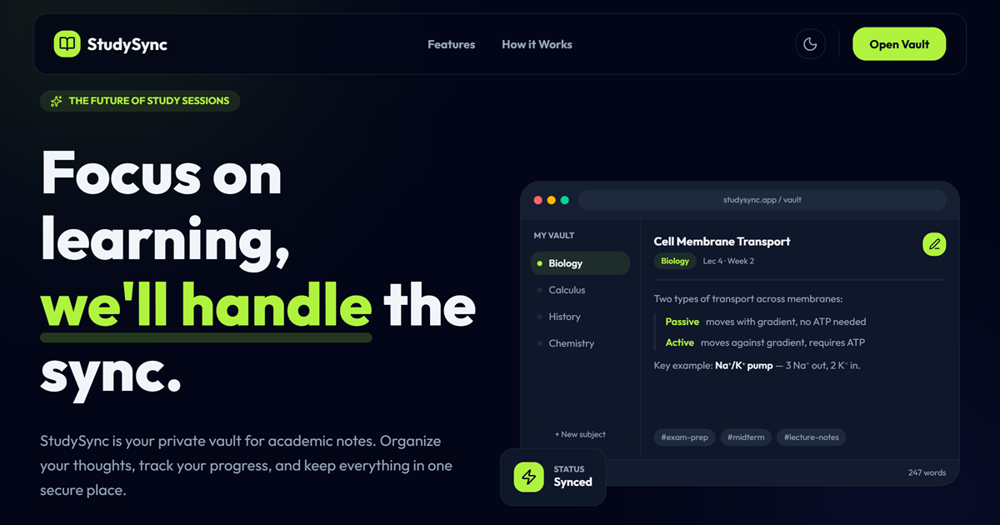
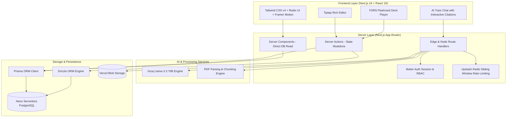

<div align="center">

# 🧠 StudySync

### The AI-Powered Study Command Center & Personal Knowledge Vault

*Transform scattered courses, lecture notes, and PDFs into an interconnected student model with source-grounded AI tutoring, adaptive FSRS flashcards, and intelligent exam readiness planning.*

[](https://www.studysync.website)
[](https://nextjs.org/)
[](https://react.dev/)
[](https://www.typescriptlang.org/)
[](https://tailwindcss.com/)
[](https://neon.tech/)
[](https://groq.com/)
[](LICENSE)

<br />

<p align="center">
  <a href="https://www.studysync.website">
    
  </a>
</p>

<p align="center">
  <a href="https://www.studysync.website"><strong>Explore Live Demo »</strong></a>
  &nbsp;&nbsp;•&nbsp;&nbsp;
  <a href="./ARCHITECTURE.md"><strong>Architecture Guide »</strong></a>
  &nbsp;&nbsp;•&nbsp;&nbsp;
  <a href="./ROADMAP.md"><strong>Product Roadmap »</strong></a>
  &nbsp;&nbsp;•&nbsp;&nbsp;
  <a href="#-getting-started"><strong>Quick Start »</strong></a>
</p>

</div>

---

## 📖 Table of Contents

- [The Core Problem](#-the-core-problem)
- [The Vision: "StudySync Knows You"](#-the-vision-studysync-knows-you)
- [Key Features](#-key-features)
  - [1. Hierarchical Knowledge Vault](#1-hierarchical-knowledge-vault)
  - [2. Source-Grounded AI Tutor](#2-source-grounded-ai-tutor-with-citations)
  - [3. Modern FSRS Spaced Repetition](#3-modern-fsrs-spaced-repetition)
  - [4. Concept Mastery & Misconception Engine](#4-concept-mastery--misconception-engine)
  - [5. AI Study Planner & Exam Readiness](#5-ai-study-planner--exam-readiness)
  - [6. Distraction-Free Focus Mode](#6-distraction-free-focus-mode)
  - [7. Rich Markdown Workspace](#7-rich-markdown-workspace)
- [System Architecture & Data Flow](#-system-architecture--data-flow)
- [Tech Stack](#-tech-stack)
- [Database & Schema Architecture](#-database--schema-architecture)
- [Engineering Standards & Best Practices](#-engineering-standards--best-practices)
- [Directory Structure](#-directory-structure)
- [Getting Started](#-getting-started)
  - [Prerequisites](#prerequisites)
  - [Installation & Setup](#installation--setup)
  - [Environment Variables](#environment-variables)
- [Roadmap & Future Milestones](#-roadmap--future-milestones)
- [Author & Acknowledgments](#-author--acknowledgments)
- [License](#-license)

---

## 🚨 The Core Problem

Modern student and lifelong learners are drowning in a disjointed landscape of disconnected productivity and study tools:

* 📑 **PDFs and slides** get buried in Google Drive folders or local downloads.
* 📝 **Lecture notes** live across Apple Notes, Notion, and Google Docs.
* 📇 **Flashcards** sit isolated inside Anki or Quizlet with manual data entry.
* 🤖 **AI tutors (like ChatGPT)** hallucinate because they lack grounded context of the student's specific syllabus and course materials.
* 🗓️ **Exam schedules and study planners** exist on static calendars that don't know what material the student actually struggles with.

When tools don't communicate, study sessions become fragmented, passive, and inefficient.

---

## 💡 The Vision: "StudySync Knows You"

**StudySync solves this fragmentation by building a continuous, closed-loop student model.**

Your uploaded materials feed into an atomic concept graph. The concept graph feeds your AI tutor and generates adaptive quizzes. Your performance on quizzes and flashcards updates your memory retention curve and pinpoints active misconceptions. This dynamic state drives your daily study schedule and predicts your exam readiness score.

```
                  ┌─────────────────────────────────────────┐
                  │          Course Knowledge Vault         │
                  │   (PDFs, Slides, Transcripts, Notes)    │
                  └────────────────────┬────────────────────┘
                                       │ Extracts & Semantic Chunks
                                       ▼
                  ┌─────────────────────────────────────────┐
                  │              Concept Graph              │
                  │       (Atomic Units of Knowledge)       │
                  └────────────┬───────────────────┬────────┘
                               │                   │
                Generates For  │                   │ Feeds Context
                               ▼                   ▼
                  ┌──────────────────────┐       ┌────────────────────────┐
                  │ Adaptive Flashcards  │       │ Source-Grounded        │
                  │   & Quiz Generator   │       │ AI Tutor (Groq 70B)    │
                  └────────────┬─────────┘       └───────────┬────────────┘
                               │                             │
               Performance Log │                             │ Detected
               (FSRS Review)   │                             │ Misconceptions
                               ▼                             ▼
                  ┌───────────────────────────────────────────────┐
                  │             UNIFIED STUDENT MODEL             │
                  │  • Concept Mastery Probability: P(L_k)        │
                  │  • Memory Stability & Retention Curves (FSRS) │
                  │  • Diagnosed Misconceptions & Error Types     │
                  └───────────────┬───────────────────────────────┘
                                  │
                   Drives Schedule│Predicts Outcome
                                  ▼
                  ┌──────────────────────┐       ┌────────────────────────┐
                  │ Dynamic Daily Plan   │       │ Exam Readiness Score   │
                  │ "What to study today"│       │ & Diagnostic Mock Test │
                  └──────────────────────┘       └────────────────────────┘
```

---

## ✨ Key Features

### 1. Hierarchical Knowledge Vault
* **Structured Curriculum Tree:** Organize content by **Semester $\rightarrow$ Course $\rightarrow$ Unit $\rightarrow$ Materials**.
* **Multi-Format Ingestion:** Upload lecture slide decks, syllabus PDFs, research papers, YouTube lecture transcripts, and markdown notes.
* **Semantic Document Segmentation:** Documents are pre-parsed into indexed chunks retaining page numbers and exact timestamps.

### 2. Source-Grounded AI Tutor (with Citations)
* **Zero-Hallucination Philosophy:** The AI tutor retrieves context directly from your vault materials before answering.
* **Interactive Citation Chips:** Responses feature verified citation tags (e.g., `[Slide 14]`, `[Page 28]`, `[08:45]`). Clicking any chip opens a slide-over viewer displaying the exact source snippet.
* **Customizable Scope:** Chat with your **entire course syllabus**, a **single lecture slide deck**, or drill into a **specific concept**.

### 3. Modern FSRS Spaced Repetition
* **FSRS Algorithm Integration:** Moves beyond basic binary flashcard memorization to modern **Free Spaced Repetition Scheduling**.
* **Memory Curve Tracking:** Computes card difficulty ($D$), memory stability ($S$), retrievability ($R$), and interval schedules to maximize long-term retention with minimal review load.
* **Automated Card Generation:** Convert raw lecture notes or PDF sections into targeted flashcard decks with a single click via high-throughput Groq AI inference.

### 4. Concept Mastery & Misconception Engine
* **Knowledge Graphs:** Breaks subjects down into atomic concepts connected by prerequisite, dependency, and part-of relationships.
* **Diagnostic Mastery Scores:** Dynamic score from $0.0 \rightarrow 1.0$ measuring understanding per concept.
* **Error Diagnosis:** Detects recurring student error patterns (*calculation error*, *concept gap*, *misread*, or *recall failure*) and recommends targeted remediation.

### 5. AI Study Planner & Exam Readiness
* **Adaptive Daily Queue:** Replaces static study checklists with a prioritized daily study schedule based on upcoming exam deadlines, concept mastery deficits, and FSRS memory decay.
* **Exam Readiness Snapshots:** Continuous percentage readiness predictions so you know exactly where you stand days before an exam.

### 6. Distraction-Free Focus Mode
* **Pomodoro Engine:** Customizable deep work and break timers designed to maintain cognitive flow.
* **Ambient Soundscapes:** Built-in focus sound options (rain, lo-fi, white noise).
* **Habit & Streak Analytics:** Track consecutive active study days, time invested per subject, and daily focus velocity.

### 7. Rich Markdown Workspace
* **Tiptap-Powered Editor:** Modern block editor with markdown shortcuts, syntax highlighting, callout blocks, and clean typography.
* **Auto-Save & Resilient Drafts:** Real-time draft persistence prevents lost notes on browser crashes or network drops.
* **Full-Text Instant Search:** Millisecond search across notes, tags, and course subjects.

---

## 📐 System Architecture & Data Flow

StudySync is built on a **Server-First, Composed Component Architecture** engineered to maximize server-side rendering, eliminate client data waterfalls, and ensure responsive interactions.



---

## 🛠️ Tech Stack

| Layer | Technology | Description |
| :--- | :--- | :--- |
| **Framework** | [Next.js 16 (App Router)](https://nextjs.org/) | Hybrid architecture with React Server Components (RSC) and Server Actions |
| **Frontend Core** | [React 19](https://react.dev/) + [TypeScript 5](https://www.typescriptlang.org/) | Type-safe, concurrent rendering with modern React primitives |
| **Styling & UI** | [Tailwind CSS v4](https://tailwindcss.com/) + [Radix UI](https://www.radix-ui.com/) | Curated dark/light theme tokens, accessible headless primitives, [Lucide Icons](https://lucide.dev/) |
| **Animations** | [Framer Motion](https://www.framer.com/motion/) | Fluid micro-interactions, smooth swipe gestures for flashcards |
| **Rich Text** | [Tiptap](https://tiptap.dev/) | Headless block-based editor supporting rich markdown and auto-save |
| **Database** | [Neon PostgreSQL](https://neon.tech/) | Serverless Postgres with branching, pooling, and `pgvector` compatibility |
| **ORMs** | [Prisma](https://www.prisma.io/) & [Drizzle](https://orm.drizzle.team/) | Type-safe relational database management and fast serverless querying |
| **AI Inference** | [Groq SDK](https://groq.com/) (`llama-3.3-70b-versatile`) | Ultra-low latency LLM inference for real-time study tutoring and Q&A |
| **Authentication** | [Better Auth](https://www.better-auth.com/) | Modern session management, email/password, and Google OAuth |
| **Rate Limiting** | [Upstash Redis](https://upstash.com/) + `@upstash/ratelimit` | Sliding-window DDoS and abuse protection on serverless endpoints |
| **File Storage** | [Vercel Blob](https://vercel.com/storage/blob) | Distributed cloud storage for uploaded documents and user media |
| **Email Service** | [Resend](https://resend.com/) + [React Email](https://react.email/) | Transactional welcome and notification emails |
| **Analytics** | [PostHog](https://posthog.com/) | Privacy-friendly product telemetry and feature tracking |

---

## 🗄️ Database & Schema Architecture

The database is organized into **4 structured layers** modeled to support the full student lifecycle:

```
Layer 1: Identity & Authentication
├── User (Credentials, Profile, Verification, Roles)
├── Session (Active tokens, IP address, Device agent)
└── Account (OAuth provider links)

Layer 2: Curriculum & Content Vault
├── Semester (Academic term grouping)
├── Course (Subjects, color tags, codes)
├── CourseUnit (Hierarchical syllabus chapters/topics)
├── VaultMaterial (PDFs, slides, video transcripts, metadata)
└── MaterialChunk (Semantic chunks with page numbers & vector embeddings)

Layer 3: Learning Content & Adaptive Practice
├── Concept (Atomic knowledge entities & importance weighting)
├── ConceptRelationship (Prerequisites, dependencies, taxonomies)
├── QuizQuestion (Multi-choice, short-answer, code, difficulty rating)
├── QuestionSource (Verifiable citation mapping back to MaterialChunk)
└── Flashcard (FSRS state: stability, difficulty, lapses, review due dates)

Layer 4: Student Model & Analytics
├── UserConceptMastery (Dynamic mastery probability score: 0.0 - 1.0)
├── Misconception & UserMisconception (Diagnosed recurring learning traps)
├── QuestionAttempt (Timestamped logs, response time, AI error diagnosis)
├── FlashcardReview (FSRS rating logs: Again, Hard, Good, Easy)
├── Exam & ExamReadinessSnapshot (Milestone dates & projected readiness curve)
└── StudyPlan & StudyTask (Dynamic daily tasks weighted by concept gap & exam proximity)
```

---

## 🛡️ Engineering Standards & Best Practices

* **Server Components by Default:** Pages are built using Server Components (`async/await` direct database queries). `"use client"` is reserved strictly for interactive leaves (forms, interactive graphs, chat inputs).
* **Thin Pages, Composed Modules:** Page route files strictly handle layout composition and data orchestration. Feature components are modularized into dedicated directories with single responsibilities.
* **Defense-in-Depth Rate Limiting:** All API endpoints and heavy AI generation routes are guarded by Upstash Redis sliding-window limiters with standard HTTP headers (`X-RateLimit-Remaining`, `X-RateLimit-Reset`).
* **Optimistic UI & Resilient Persistence:** State updates (tagging, note saving, flashcard reviews) feature immediate visual feedback backed by debounced server persistence.

---

## 📂 Directory Structure

```text
study-sync/
├── app/                              # Next.js App Router root
│   ├── (auth)/                       # Sign-in, Sign-up, Password reset flows
│   ├── (legal)/                      # Terms, Privacy Policy, Data Security
│   ├── (main)/                       # Authenticated application command center
│   │   └── dashboard/
│   │       ├── drafts/               # Auto-saved working notes
│   │       ├── flashcards/           # FSRS spaced repetition review center
│   │       ├── focus-mode/           # Pomodoro timer & ambient sound workspace
│   │       ├── library/              # Notes library with semester/subject filters
│   │       ├── schedule/             # Study calendar & exam planning
│   │       ├── study/                # Source-grounded AI Tutor interface
│   │       ├── vault/                # Document ingestion & knowledge materials
│   │       └── page.tsx              # Command Center dashboard overview
│   ├── (marketing)/                  # Landing page, hero, feature showcases
│   ├── api/                          # REST & streaming endpoints (Groq, Auth, Vault)
│   ├── layout.tsx                    # Root layout & providers
│   └── globals.css                   # Tailwind v4 theme variables
├── components/                       # Modular UI components organized by domain
│   ├── Dashboard/                    # Overview cards, activity feeds, metrics
│   ├── Flashcards/                   # Card flipper, deck manager, rating controls
│   ├── FocusMode/                    # Timer, sound controls, streak badges
│   ├── Home/                         # Landing page sections (Hero, Features, Bento)
│   ├── Library/                      # Note cards, filter drawers, sort menus
│   ├── Notes/                        # Tiptap editor toolbar, preview, autosave
│   ├── Study/                        # AI chat stream, citation chips, source drawer
│   └── ui/                           # Primitive components (Radix + Shadcn)
├── lib/                              # Core backend utilities & shared services
│   ├── auth.ts                       # Better Auth configuration
│   ├── db.ts                         # Neon connection client
│   ├── email.ts                      # Resend email client & templates
│   ├── groq.ts                       # Groq LLM client wrapper
│   ├── ratelimit.ts                  # Upstash sliding-window rate limiters
│   └── schema.ts                     # Drizzle ORM schema definitions
├── prisma/                           # Prisma schema (4-layer unified student model)
│   └── schema.prisma
├── public/                           # Static assets, diagrams, and metadata badges
├── ARCHITECTURE.md                   # Architectural conventions & component rules
├── ROADMAP.md                        # 3-Phase, 7-Pillar technical roadmap
└── package.json                      # Dependencies & project scripts
```

---

## 🚀 Getting Started

Follow these instructions to run StudySync locally on your machine.

### Prerequisites

* **Node.js**: v20.x or later (recommended: Node 20+ LTS)
* **Package Manager**: `pnpm` (preferred), `npm`, or `yarn`
* **PostgreSQL Database**: A free serverless instance from [Neon](https://neon.tech)
* **Groq API Key**: A free API key from [Groq Console](https://console.groq.com)

### Installation & Setup

1. **Clone the repository:**
   ```bash
   git clone https://github.com/michaelumoize-lab/study-sync-fixed.git
   cd study-sync-fixed
   ```

2. **Install project dependencies:**
   ```bash
   pnpm install
   # or: npm install
   ```

3. **Configure environment variables:**
   Copy the example environment file and fill in your credentials:
   ```bash
   cp .env.example .env
   ```

4. **Sync the database schema:**
   Push the schema to your Neon database instance:
   ```bash
   npx prisma db push
   ```

5. **Start the local development server:**
   ```bash
   pnpm dev
   # or: npm run dev
   ```

6. **Open your browser:**
   Navigate to [http://localhost:3000](http://localhost:3000) to view the application.

---

## 🔐 Environment Variables

Refer to [`.env.example`](./.env.example) for a complete template. Here is an overview of key variables:

| Variable | Required | Purpose |
| :--- | :---: | :--- |
| `DATABASE_URL` | **Yes** | Neon PostgreSQL connection string with SSL enabled |
| `BETTER_AUTH_SECRET` | **Yes** | 32+ character random secret used for session tokens |
| `BETTER_AUTH_URL` | **Yes** | Base URL for auth callbacks (`http://localhost:3000` locally) |
| `GROQ_API_KEY` | **Yes** | API key for high-speed Llama 3.3 70B inference |
| `UPSTASH_REDIS_REST_URL` | **Yes** | Upstash Redis instance endpoint for sliding window rate limiting |
| `UPSTASH_REDIS_REST_TOKEN` | **Yes** | Secret token for Upstash Redis instance |
| `BLOB_READ_WRITE_TOKEN` | Optional | Vercel Blob token for file and media uploads |
| `RESEND_API_KEY` | Optional | Resend key for transactional email delivery |
| `GOOGLE_CLIENT_ID` | Optional | Google OAuth client ID for social login |
| `GOOGLE_CLIENT_SECRET`| Optional | Google OAuth client secret |
| `NEXT_PUBLIC_POSTHOG_KEY` | Optional | PostHog project key for product analytics |

---

## 🗺️ Roadmap & Future Milestones

StudySync is under active development. For in-depth technical specifications, review [`ROADMAP.md`](./ROADMAP.md).

- [x] **Phase 1 — Foundation (Completed & Current):**
  - [x] Hierarchical Course & Knowledge Vault
  - [x] Groq-powered AI Tutor with verifiable source citation chips
  - [x] Tiptap markdown workspace with real-time auto-saving
  - [x] Multi-provider authentication & Redis sliding-window security
- [ ] **Phase 2 — Learning Engine (In Progress):**
  - [ ] Full FSRS v4 memory stability & retention scheduler integration
  - [ ] Automatic concept graph extraction from course materials
  - [ ] Diagnostic adaptive quiz generation with misconception tagging
  - [ ] Neon `pgvector` hybrid search (dense vectors + full-text BM25)
- [ ] **Phase 3 — Intelligence & Optimization:**
  - [ ] Multi-modal lecture ingestion (YouTube timestamps & audio transcripts)
  - [ ] Automated daily study scheduling engine ("What to study today")
  - [ ] Predictive exam readiness forecasting & simulated mock exams

---

## 👨‍💻 Author & Acknowledgments

**StudySync** was architected and built with ❤️ by **Michael Umoize**.

* **Website:** [studysync.website](https://www.studysync.website)
* **GitHub:** [@michaelumoize-lab](https://github.com/michaelumoize-lab)
* **Twitter / X:** [@miketech_90](https://twitter.com/miketech_90)
* **Email:** [michaelumoize@gmail.com](mailto:michaelumoize@gmail.com)

Special thanks to the open-source teams behind **Next.js**, **Neon**, **Groq**, **Better Auth**, and **Tailwind CSS**.

---

## 📄 License

This project is licensed under the **MIT License** — see the [LICENSE](LICENSE) file for details.

<div align="center">
  <sub>Built for students who want to study smarter, retain more, and ace their exams.</sub>
</div>
